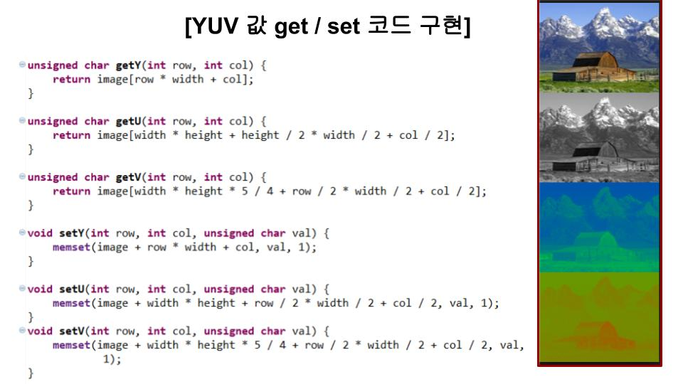
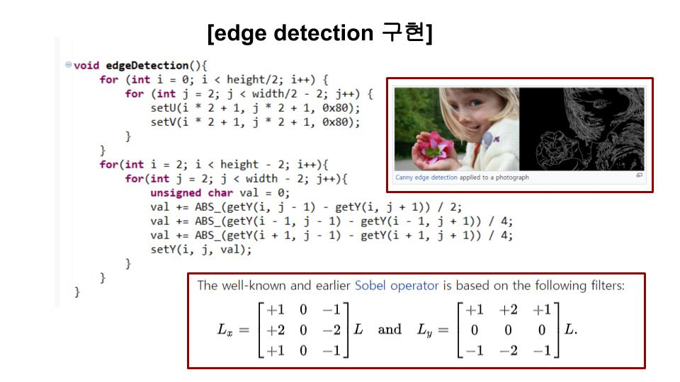
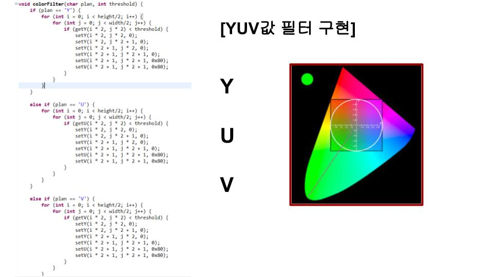
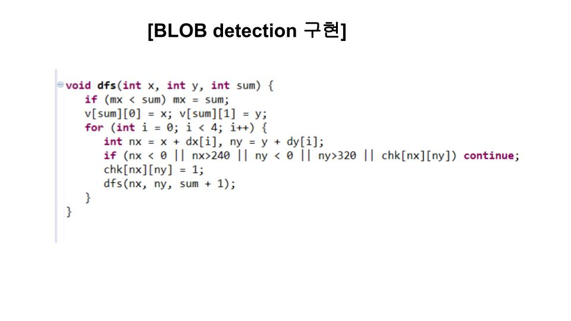
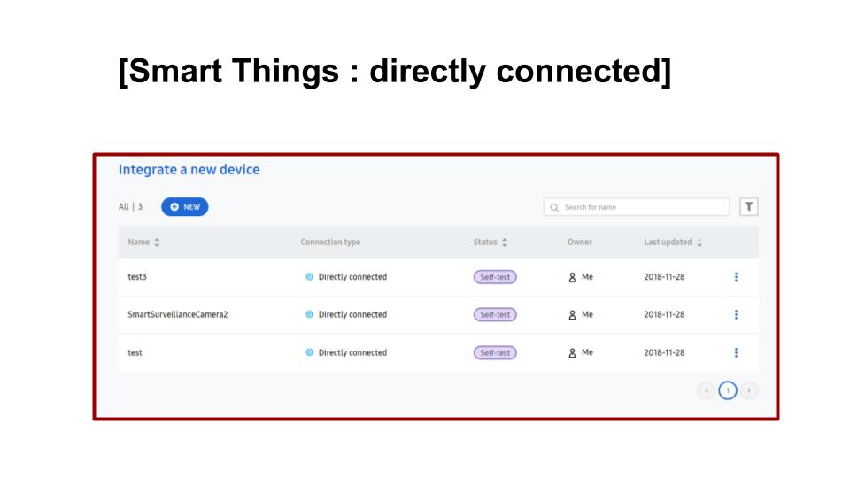
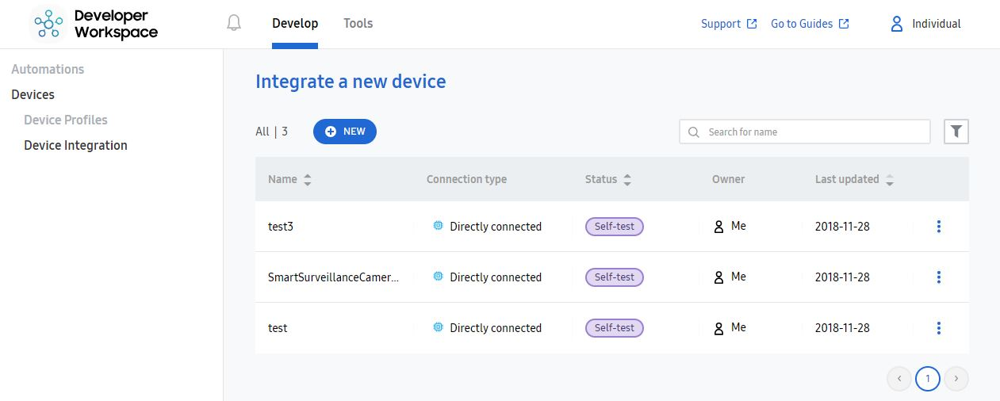

# 2018 미니 해커톤 (제3회 공개SW 커뮤니티데이)
* 카메라를 사용하여 이미지를 분석한 후 출력하기
* 2018.11.27 ~ 28

## TIZEN 1팀x2팀
 
- 주제 : **SmartFarm 야생동물 Detection Project**
- 카메라 영상을 통한 야생동물을 Detection하고 인식하는 프로젝트를 기획하였다.

<pre><code>- Eageleye 530s or Rpi3 or Artik1
- USB Camera1
- Tizen 5.0
- SmartThings
- Smart Surveillance Camera Application
- IoT.js</code></pre>

## 프로젝트 설명

### YUV 값 get / set 코드 구현

 

### 물체의 외곽선을 detect하는 코드 구현

 

### 영상을 원하는 컬러로 출력하는 필터 구현

 

### blob detection 구현

 

### samsung smart-things 연동을 위한 master.json / resourse.json 수정
 

  
 

### smarthings develope에서 components 설정 및 device 등록
 

  
 

